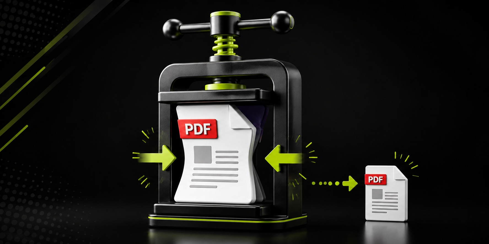
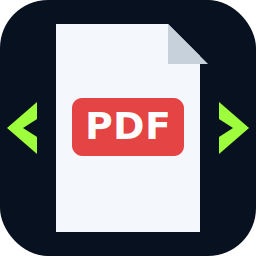

<p align="center">
  
</p>

<div align="center">
  

# PDF Shrinker

**Drop PDFs in. Press one button. Get smaller PDFs out.**

A lightweight Windows desktop utility for local, drag-and-drop PDF compression. No upload service, account, browser limit, or cloud processing is required.


</div>

## What it does

1. Drag one or more PDF files into the app.
2. Choose a compression preset.
3. Click **RUN COMPRESSION**.
4. Collect separately named compressed copies.

The source PDFs are never overwritten.

## Features

- Drag-and-drop and normal file selection
- Batch processing
- Large, obvious **RUN COMPRESSION** control
- Automatic mode that keeps the smallest valid result
- Extreme raster compression for minimum file size
- Lossless PDF cleanup
- Optional Ghostscript compression that preserves selectable text
- Optional grayscale conversion
- Output size and percentage-saved reporting
- Dark Windows interface
- Portable EXE and proper installer builds
- Desktop and Start Menu shortcuts
- Automated Authenticode self-signing during local builds

## Compression modes

| Mode | Best for | Trade-off |
|---|---|---|
| Auto smallest | General use and maximum reduction | May rasterize when that produces the smallest result |
| Extreme minimum | Email-size documents and scans | Removes selectable text, forms, links, layers, and accessibility structure |
| Smallest with selectable text | Text-heavy PDFs | Requires Ghostscript for the strongest result |
| Balanced with selectable text | Better visual quality | Larger than the smallest preset |
| Lossless cleanup | Archival-friendly cleanup | Reduction may be modest |

## Running from source

```powershell
py -3 -m venv .venv
.\.venv\Scripts\python.exe -m pip install -r requirements.txt
.\.venv\Scripts\python.exe .\make_icon.py
.\.venv\Scripts\python.exe .\pdf_shrinker.py
```

Ghostscript is optional. The app automatically detects common Windows installations.

## One-click Windows build

Requirements:

- Windows 10 or Windows 11
- Python 3.11 or newer
- Inno Setup 6 or 7

Run:

```powershell
powershell.exe -NoProfile -ExecutionPolicy Bypass -File .\BUILD_PDF_SHRINKER.ps1
```

Or double-click `RUN_BUILD.bat`.

The build script creates a working project and release structure under:

```text
Desktop\Marks Apps\PDF Shrinker
```

Completed artifacts are written to:

```text
Desktop\Marks Apps\PDF Shrinker\Release
```

The release folder contains the portable executable, installer, source package, coworker package, hashes, signature report, and exported public certificate. The installer itself contains only the application—it does not add this README to the installed folder.

## Signing note

The local build script creates or reuses a self-signed **Dietrich AI Labs** Authenticode certificate and signs the application and installer. This verifies file integrity, but a self-signed certificate does not automatically establish public trust or remove Windows SmartScreen warnings on another computer.

Never commit or distribute an exported private key such as a `.pfx` or `.p12` file.

## Important compression warning

Raster compression is intentionally destructive. It is useful when minimum size matters more than document structure. Always inspect compressed output before deleting the original document.

## Publisher

**Dietrich AI Labs**